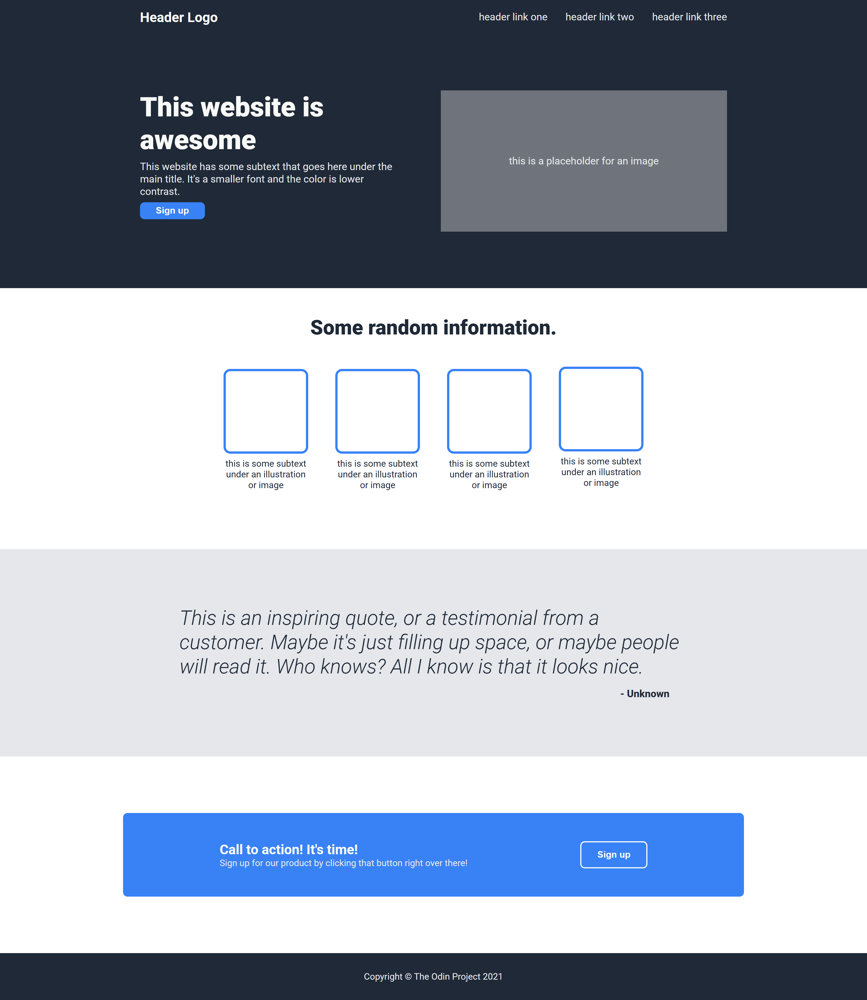

# Project: Landing Page

## Description

- In this project, I created a web page from a provided design
- Live preview: https://averdonks.github.io/landing-page/

## Skills

HTML
- Page structure

CSS
- Flexbox

Git
- Version control

## Image

## Reflection

Creating this web page gave me good practice with practically applying HTML and CSS. I've gained a better understanding of Flexbox and I'm excited to move on to JavaScript!